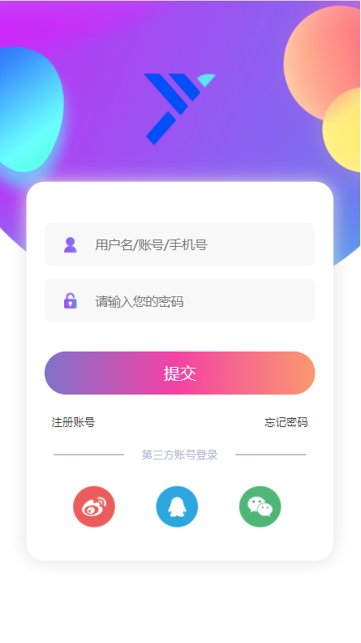
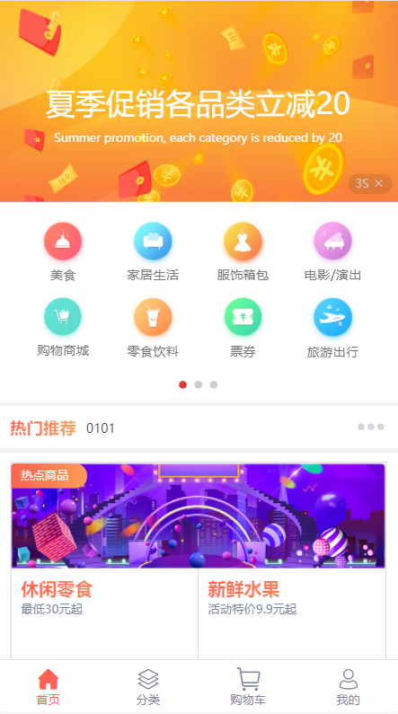
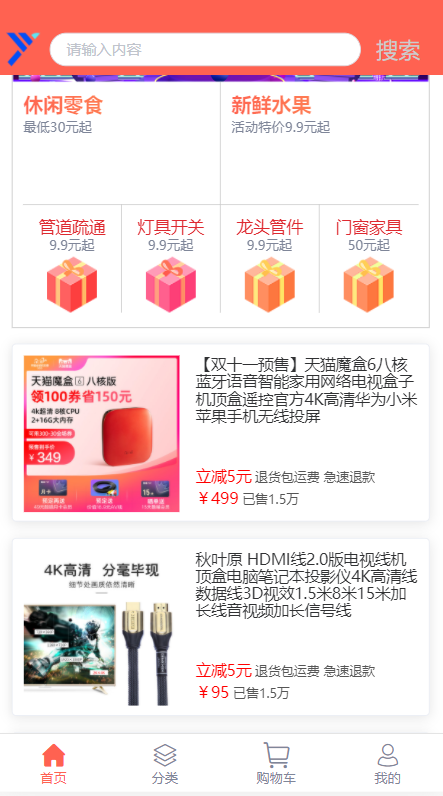
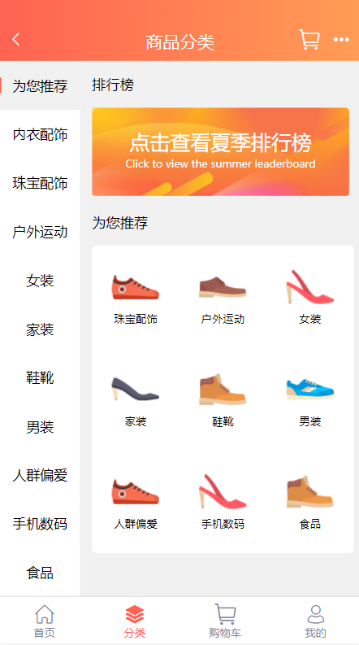
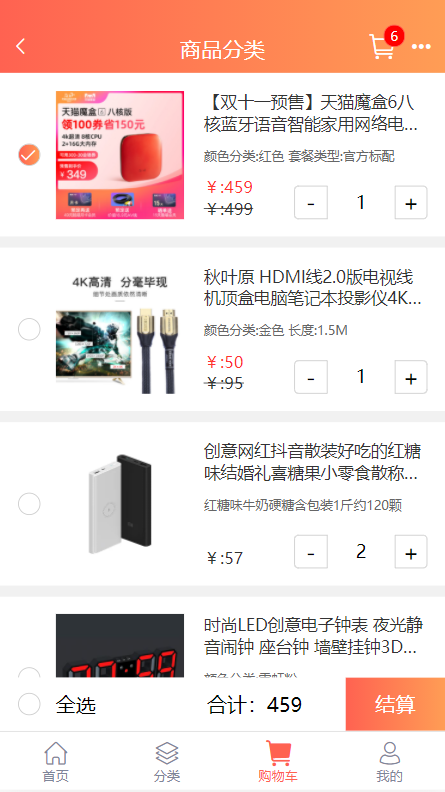
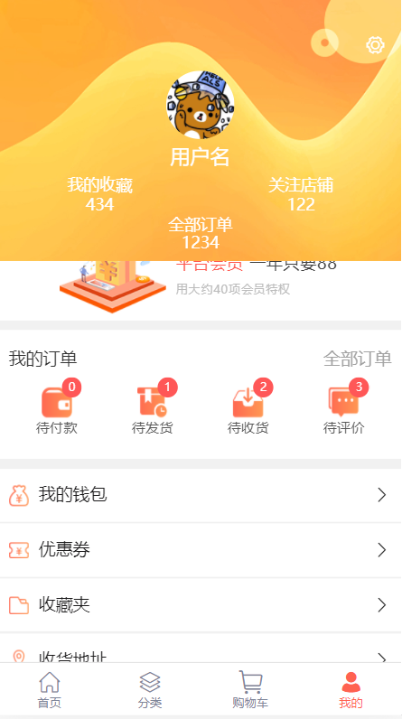
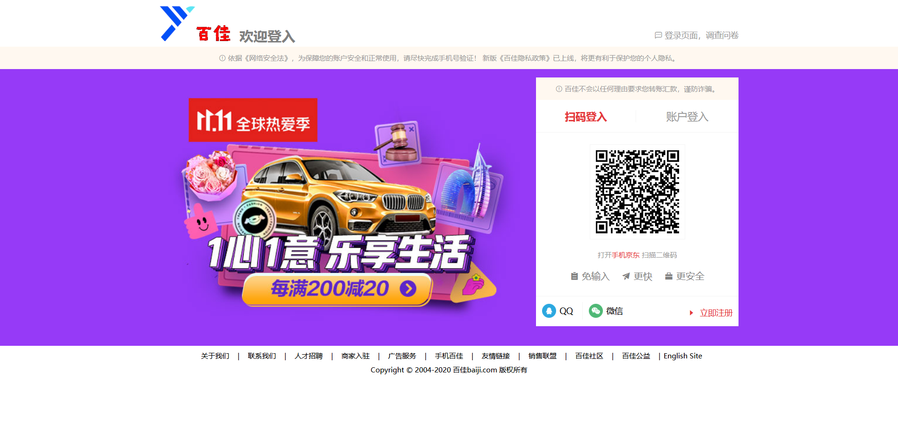
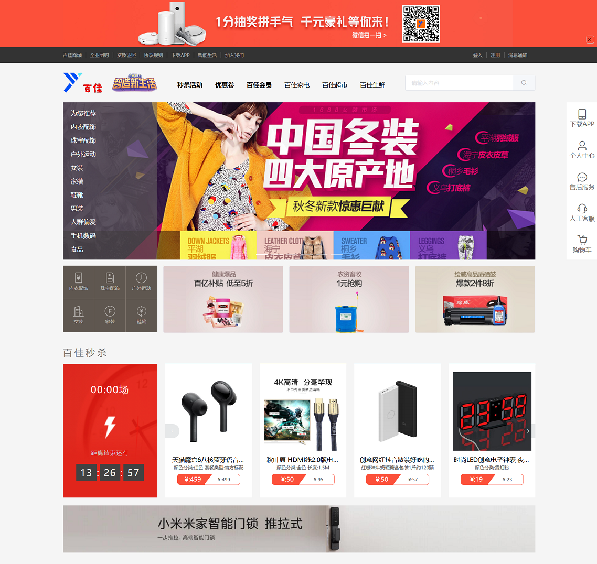
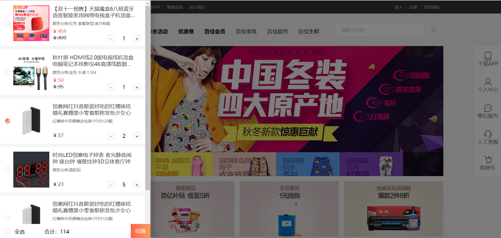
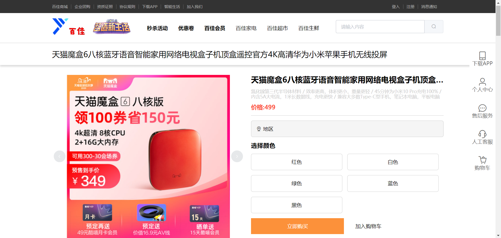

# 百佳商城项目

### 项目简述

+ 技术栈：h5 c3 js vue ajax
+ 为双端设计不同页面
+ 使用软件vscode
+ 没有使用vue的脚手架搭建

### 界面效果

图片无法查看请下载或者墙
+ 移动端web
    - 登录页
        使用默认账户
        name:"admin", password: "admin" 
        可登入进入(并非ajax请求验证)
        
    - 首页
        提供搜索、推荐、最新活动
         
    - 分类
        可根据商品分类查找商品
        
    - 购物车
        可请求用户购物车信息，操作后展示
        可计算勾选商品统计价格提交请求
        
    - 我的
        显示订单信息和简单设置
        
    - 活动页面
        通过首页活动广告进入
        

+ pc端web
    - 登录页
        提供账号与二维码两种登录方式
        二维码登录，10秒未响应超时刷新
        
    - 首页
        提供最新活动、秒杀活动、分类、购物车功能
        
        侧栏式购物车
        
    - 商品详情页
        通过地址id获取商品号显示详情页
        

### 项目文件介绍

+ activity.html [移动端活动样式]
+ favicon.ico [网页图标]
+ index.html [移动端首页样式]
+ indexpc.html [pc端首页样式]
+ README.md
+ shop.html [商品详情页模板样式]
+ shop.json
+ sign.html [移动端登录样式]
+ signpc.html [pc端登录样式]

+ css
    - activity.css [移动端活动样式]
    - base.css [基础样式]
    - element-index.css [element组件库样式]
    - index.css [移动端首页样式]
    - indexpc.css [pc端首页样式]
    - normalize.css [初始化浏览器样式]
    - shop.css [商品详情页模板样式]
    - sign.css [移动端登录样式]
    - signpc.css [pc端登录样式]
    - swiper-bundle.min.css [swiper插件样式]

+ fonts
    - elementUI图标库
    - iconfont阿里图标库

+ img
    - 图片素材

+ js [文件叙述同css]
    - activity.js
    - axios.min.js
    - element-index.js
    - index.js
    - indexpc.js
    - jquery-3.5.1.min.js
    - shop.js
    - sign.js
    - signpc.js
    - swiper-bundle.min.js
    - vue.js
